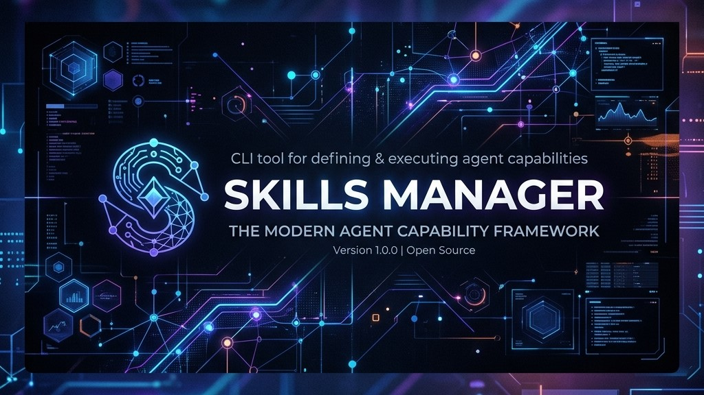

# Skills Manager
<p align="center">
  
</p>

[](https://github.com/ericmaster/skills-manager/actions/workflows/ci.yml)

A CLI and default-installed agent skill for managing [agentskills.io](https://agentskills.io/specification)-format skills across every AI agent tool on your machine.

## Why skills-manager

If you use multiple AI coding agents — Claude Code, Codex, Cursor, Antigravity CLI, OpenCode, and friends — you've probably noticed that each one has its own idea of where skills should live and how they should be installed. Tools like [vercel-labs/skills](https://github.com/vercel-labs/skills) already do an excellent job of resolving sources and linking skills into ~54 agent tools. What they don't do:

- Treat one canonical directory as the **single source of truth** for every skill on the machine.
- **Survive customization** of contrib skills across re-downloads — local edits get clobbered when an upstream version is fetched again.

`skills-manager` adds those two layers on top:

1. **A single source of truth.** `~/.skills-manager/` is where every skill on your machine — contrib or self-authored — physically resides. Each agent tool sees skills via symlinks into this directory, so you have exactly one place to look, edit, version-control, or back up.
2. **Survivable customizations.** When you tweak a contrib skill, your edits are captured as a unified-diff patch and reapplied automatically on every update. Upstream changes that conflict with your edits surface explicitly via 3-way merge; nothing is silently overwritten.

The CLI delegates source resolution and the bulk of the multi-agent compatibility matrix to `vercel-labs/skills` as a subprocess. `skills-manager` focuses on what's missing: SSOT governance and the patch lifecycle.

## Highlights

- **Single source of truth** at `~/.skills-manager/` — every skill, contrib or self-authored.
- **Survivable customizations** — local edits captured as unified-diff patches and replayed on every update; conflicts surfaced via 3-way merge.
- **Multi-agent** — symlinks the SSOT into each detected tool's expected location automatically.
- **Workspace mode** — drop a `.skills-manager/` into a project for per-project skills, fully isolated from your global setup.
- **Bundled agent skill** — agents that read `SKILL.md` learn how to drive the CLI on your behalf.

## Installation

### From NPM (Recommended)

You can run the tool directly without manual cloning and compilation:

```bash
# Run one-off to initialize
npx skmgr init

# Or install globally to use the `skills-manager` command anywhere
npm install -g skmgr
# or
pnpm add -g skmgr
```

Once installed globally, you can run any command directly:

```bash
skills-manager init
```

### From Source (Development)

If you are developing or contributing to the project:

```bash
pnpm install
pnpm build
node bin/skills-manager.js init
```

`init` creates the SSOT root, scaffolds the manifest and state files, detects installed agent tools, installs the bundled `skills-manager` agent skill, and links it into every detected tool that natively supports `SKILL.md`. Pass `init --local` to target `<cwd>/.skills-manager/` instead of your home directory.

## Status

| Command | Status |
|---------|--------|
| `init` | Wired |
| `adopt` | Wired |
| `add` | Wired |
| `diff` | Wired |
| `save-patch` | Wired |
| `update` / `update --continue` | Wired |
| `list` | Wired |
| `remove` | Wired |
| `customize` | Wired |
| `new` | Wired |
| `tool list` / `tool enable` / `tool disable` | Planned (v0.3.0) |
| `validate` | Planned (v0.3.0) |
| `doctor` | Wired |

See [Roadmap](#roadmap) for what's planned next.

## Commands

| Command | What it does | Status |
|---------|--------------|--------|
| `init [--local]` | Set up the SSOT and link the bundled agent skill into all detected tools. | Wired |
| `adopt [<name>] [--all]` | Pull skills already living under detected tool dirs into the SSOT. | Wired |
| `add <source>` | Install a contrib skill from a git repo, direct URL, or local path. | Wired |
| `list` | List installed skills with source, ref, and customized flag. | Wired |
| `remove <skill>` | Delete a skill, its patch, its pristine cache, and all tool symlinks. | Wired |
| `update [<skill>...]` | Re-resolve sources and reapply your customization patches. | Wired |
| `update --continue <skill>` | Resume a paused update after manually resolving a 3-way merge conflict. | Wired |
| `diff <skill>` | Show what you've changed in a skill vs. its pristine upstream. | Wired |
| `save-patch <skill>` | Persist your current edits to `patches/<skill>.patch`. | Wired |
| `customize <skill>` | Open a skill directory in `$EDITOR`. | Wired |
| `new <name>` | Scaffold a new self-authored skill. | Wired |
| `tool list` | Show detected tools and which are linked. | Planned (v0.3.0) |
| `tool enable <name>` / `tool disable <name>` | Opt a detected tool in or out of linking. | Planned (v0.3.0) |
| `validate [<skill>]` | Validate one or all skills against the agentskills.io spec. | Planned (v0.3.0) |
| `doctor` | Print a summary of your environment, dependencies, and any warnings. | Wired |

## Adopting existing skills

Already running with skills under `~/.claude/skills/`, `~/.hermes/skills/`, or another tool's directory? `init` won't touch them — adoption is explicit.

```bash
skills-manager adopt              # list adoptable skills + any conflicts
skills-manager adopt my-skill     # adopt one
skills-manager adopt --all        # adopt every non-conflicting candidate
skills-manager adopt my-skill --dry-run   # preview without changes
```

What `adopt` does for each skill:

1. Moves the skill directory into `~/.skills-manager/authored/<name>/`.
2. Replaces the original location with a symlink into the SSOT.
3. Records the skill in `skills.json` as a self-authored skill.

Adopted skills become `authored` skills (no upstream tracking, no patches). If a skill is the same content across multiple tools, the redundant copies are removed and every tool ends up symlinked to the one canonical copy.

If the same skill name exists in multiple tools with **different** content, `adopt` stops and asks you to pick:

```bash
# Take the Claude Code copy; back up the others into .cache/adopted-backup/.
skills-manager adopt my-skill --from claude-code

# Take the Claude Code copy AND keep the hermes copy as a separately named skill.
skills-manager adopt my-skill --from claude-code --keep-other-as my-skill-hermes
```

## Sources

`add` accepts:

- **Git repos** — multi-skill (`anthropics/skills`) or single-skill (`voodootikigod/some-skill`).
- **Direct URLs** — `https://example.com/skill.tar.gz`, raw `SKILL.md`, etc.
- **Local paths** — `~/dev/my-skill/`. Treated like a remote-less repo.

The exact resolved ref is pinned in `skills.lock.json` so updates are reproducible.

## Customizing a contrib skill

Open `~/.skills-manager/skills/<name>/` in your editor (or run `skills-manager customize <name>`) and change whatever you like. Your edits are captured automatically:

- `skills-manager diff <name>` shows what's drifted from upstream.
- `skills-manager save-patch <name>` persists those edits to `patches/<name>.patch`.
- The next `skills-manager update` re-fetches the upstream, replays your patch on top, and surfaces any conflicts via 3-way merge.

Self-authored skills (in `authored/`) are not patched — the directory itself is the source of truth.

## Updating

`skills-manager update` walks every contrib skill (or just the names you pass):

1. Captures any uncommitted drift in your live skill into the patch file.
2. Fetches the latest upstream into a staging directory.
3. Replays your patch with `git apply --3way`.
4. On a clean apply, atomically swaps the live skill into place and updates the lockfile.
5. On a conflict, leaves the staging tree with merge markers and your live skill untouched. Resolve in staging, then run `skills-manager update --continue <name>`.

Your live, working skill is never left in a broken state.

## Workspaces

Run the CLI inside a directory containing `.skills-manager/` and it operates on that directory instead of `~/.skills-manager/`. Workspace and global scopes are **fully isolated**: workspace skills do not inherit from global, and global skills do not bleed into a workspace. Duplicate skill names across the two scopes print a warning but do not block.

Today, `init --local` is the primary verb that sets up a workspace scope. All other wired verbs (`adopt`, `add`, `diff`, `save-patch`, `update`) respect the workspace scope automatically.

This is handy for team-shared, project-specific skills you want to commit to the repo.

> [!IMPORTANT]
> **Workspace Adoption Behavior:** Because your AI tools (like Claude Code or Hermes) are installed globally on your machine, tool detection scans your home directory (`$HOME`) even when running within a workspace scope.
> Therefore, running `skills-manager adopt --all` inside a workspace will find unmanaged skills in your global tool directories and adopt them directly into that workspace's local `.skills-manager/authored/` folder.
> To make your skills available globally for every project, make sure to adopt or add them in the **global scope** (`~/.skills-manager/`) instead of the workspace scope. Link sites in tool folders always hold symlinks, so having them in the global scope keeps them available everywhere.

## Bundled agent skill

`init` installs the `skills-manager` agent skill into every detected tool that natively supports `SKILL.md`. The skill teaches the consuming agent when to invoke the CLI on your behalf — when you say "add the X skill," "update my skills," "customize Y," and so on — so you don't need to memorize flags.

## Tool support

| Tool | Native `SKILL.md` support | v1 status |
|------|---------------------------|-----------|
| Claude Code | Yes | Linked |
| hermes | Yes | Linked |
| openclaw | Yes | Linked |
| Codex CLI | Pending spec adoption | Detected, not linked |
| Cursor | No (uses `.mdc`) | Detected, not linked |
| Antigravity CLI | Yes | Linked |
| OpenCode | Pending | Detected, not linked |
| Crush | Pending | Detected, not linked |
| Aider | No (different model) | Detected, not linked |

Non-native tools are still listed in `skills-manager doctor` output. Adapters that translate `SKILL.md` into other formats are on the [roadmap](#roadmap).

## Roadmap

See [ROADMAP.md](ROADMAP.md) for what's planned, what's next, and what's been considered and deferred (with rationale).

## Contributing

Architecture, directory layout, update internals, CLI surface contract, and conventions live in [AGENTS.md](AGENTS.md).
